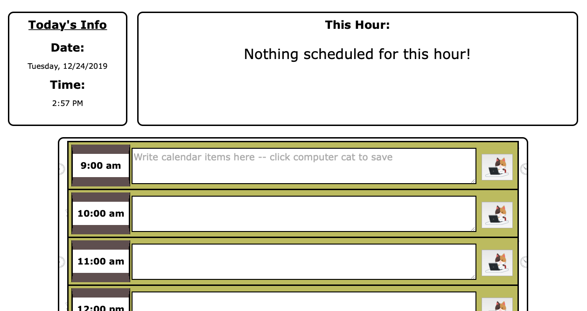
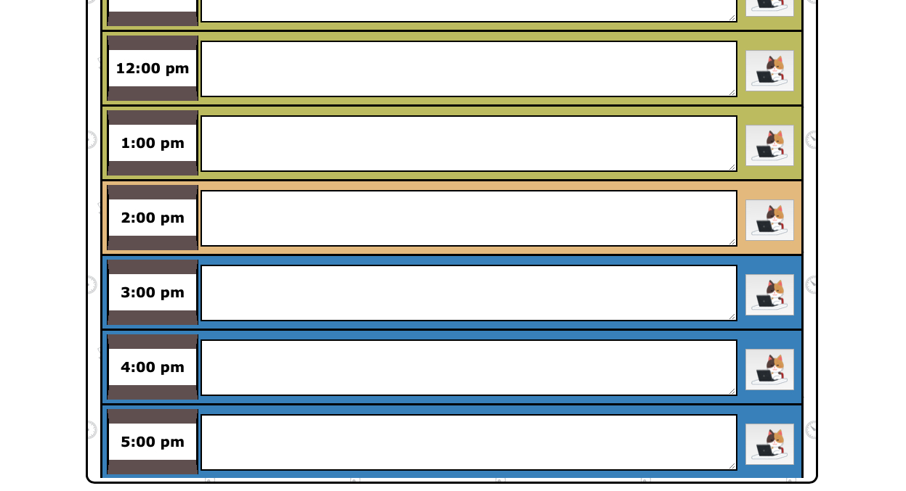

# unit-five-homework

Workday Planner

This is a basic day-planner website that allows you to type in your hourly schedule and save that content to your browser.  The features of this application are:

-Current date and time pulled from the user's OS and displayed
-Current hour's itinerary displayed in the page header
-Past hours, current hour, and future hours color-coded for ease-of-use

You can access the website at the following URL:
[https://bestbrobradley.github.io/unit-five-homework/](https://bestbrobradley.github.io/unit-five-homework/)

Futute updates will include:
-Notepad area
-Better optimization for mobile screens

